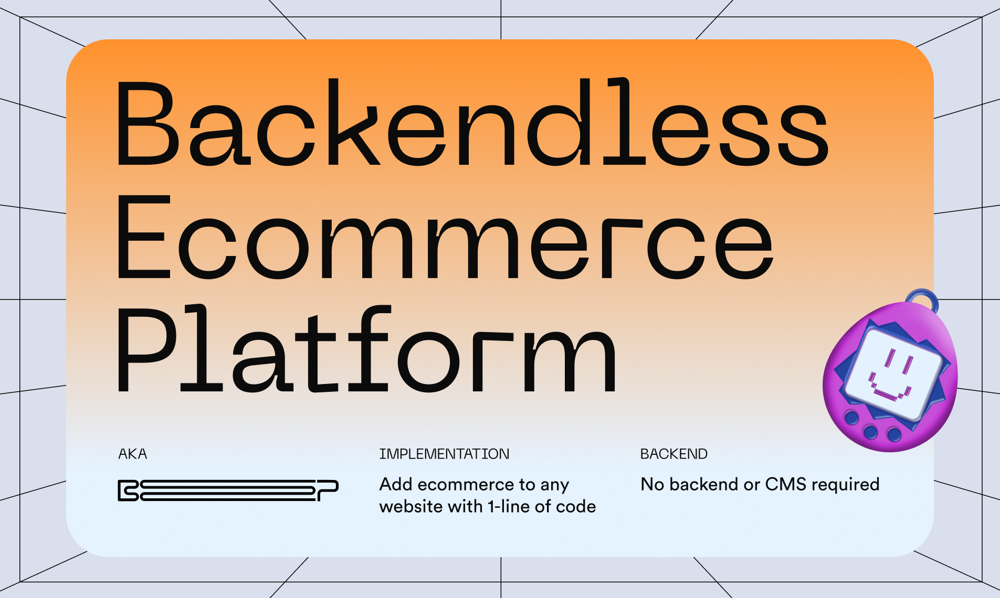
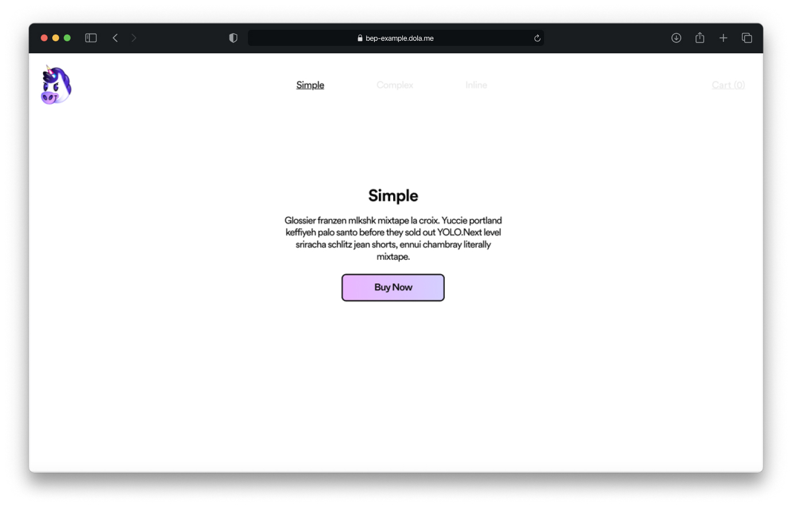
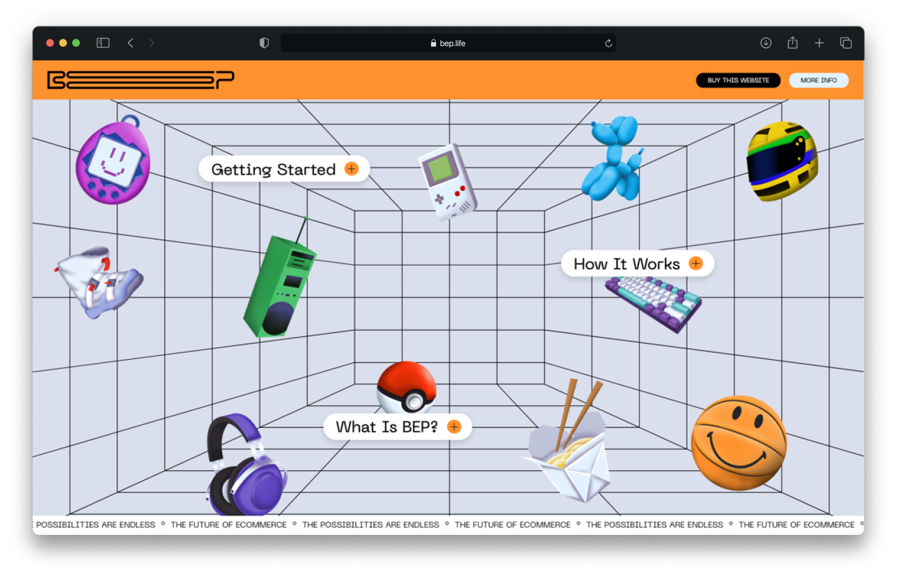

# BEP Examples



These BEP examples use BEP, in addition to Typescript along with different example integrations.

## Table of Contents

- [Overview](#overview)
- [Prerequisite](#prerequisite)
- [See it in Action](#see-it-in-action)
- [BEP Custom Theme](#bep-custom-theme)
- [Getting Started](#getting-started)
- [Examples](#examples)
- [Setup](#setup)
  - [Basic Installation](#basic-installation)
    - [data-dola-buynow](#data-dola-buynow)
    - [data-dola-cart](#data-dola-cart)
    - [data-dola-cartaction](#data-dola-cartaction)
  - [Javascript SDK](#javascript-sdk)
- [Zapier Integration](#zapier-integration)
  - [Triggers](#triggers)
  - [Actions](#actions)
- [Reference](#reference)
- [Browser Compatibility](#browser-compatibility)
- [Contribute](#contribute)
- [License](#license)

## Overview

BEP is short for “Backendless Ecommerce Platform,” and it turns any website into a shop with just one line of code.

The best part?

There's no backend or CMS to manage. Just add our snippet and you're in business!

With BEP, you can instantly accept payments from 195 countries, ship globally, get paid, and it's free _- standard 2.9% + $0.30 processing fees apply._

Whether you're building a direct-to-consumer site, a landing page for your latest drop, or a side hustle with friends and family, BEP does it all.

Also, as orders come in, BEP gives you with everything you need to fulfill, including pre-paid duties, shipping, taxes, and more. BEP also comes with an [API](https://docs.dola.me/#overview) and [Zapier app](https://zapier.com/apps/dola/integrations), so you can sync orders with your back-office.

For now, BEP is available for merchants in the U.S. and U.K.; but, consumers everywhere can purchase from a BEP store.

To get started, reference the documentation below to add BEP to any static site.

## Prerequisite

- `MERCHANT_ID`: Refer to the [Getting Started](#Getting-Started) section to find your `MERCHANT_ID`

## See it in Action



[BEP's demo site](https://bep-example.dola.me/) uses its Javascript SDK to create products and a cart.<br><br>
Demo includes:

- [Dola's 1-click Checkout](https://dola.me)
- Shopping Cart
- Complex and Simple Products

[View Demo](https://bep-example.dola.me/)

## BEP Custom Theme



[BEP's custom theme site](https://bep.life) uses its Javascript SDK to sell a single product.<br><br>
Dmo includes:

- [Dola's 1-click Checkout](https://dola.me)
- Single Product Store

[View Demo](https://bep-example.dola.me/)

## Examples

Starter kits and examples of how to get started with BEP and different integrations can be found as subdirectories.

- [NextJS](https://github.com/dolapay/bep-examples/tree/main/with-next)
- [GraphCMS with NextJS](https://github.com/dolapay/bep-examples/tree/main/with-graphcms-next)

## Setup

### Basic Installation

There are 3 HTML data attributes that trigger actions. Each action attribute is used alongside other attributes that describe the product/cart details.

#### `data-dola-buynow`

When set to `"true"`, the element, when clicked, will trigger a checkout with the product information on that element.

```html
<div>
	<button
		data-dola-buynow="true"
		data-dola-quantity="1"
		data-dola-title="productName"
		data-dola-image="imageURL"
		data-dola-price="35000"
		data-dola-weight="3000"
		data-dola-sku="productsku"
		data-dola-id="uniqueProductId"
		data-dola-currency="USD"
		class="dola-dola-bills-yall"
	>
		Buy Now
	</button>
</div>
```

#### `data-dola-cart`

When set to `"true"`, this indicates that the product (represented by the other data attributes on that element) has been added to a shopping cart.

```html
<div
	class="dola-dola-bills-yall"
	data-dola-title="currentProductTitle"
	data-dola-title="productName"
	data-dola-image="imageURL"
	data-dola-price="35000"
	data-dola-weight="3000"
	data-dola-sku="productsku"
	data-dola-id="uniqueProductId"
	data-dola-currency="USD"
	data-dola-cart="true"
	data-dola-quantity="2"
>
	Checkout
</div>
```

#### `data-dola-cartaction`

When set to `"true"`, the element, when clicked, will trigger a checkout with all products that have been added to the cart (by having their `data-dola-cart` attribute set to `"true"`).

```html
<div>
	<button data-dola-currency="USD" data-dola-cartaction="true" class="dola-dola-bills-yall">
		Checkout
	</button>
</div>
```

Only 1 action type should be used on an element at a given time.

While BEP is loading, `dola-bep-loading` is added as a class to actionable HTML elements. This can be leveraged to implement styles and other behavior for the loading state.

### JavaScript SDK

Here's a basic example:

```js
const cart = {
	currency: "USD",
	items: [
		{
			id: "randomId",
			image: "https://linkToproductimage",
			quantity: 1,
			title: "sample product",
			price: 35000,
			grams: 543,
			sku: "randomproductsku",
		},
	],
};

window.Dolapay.attachDola(cart, cb);
```

The `attachDola` method triggers an instance of Dola's 1-click Checkout. It accepts a cart object and a callback which fires in the case of a successful execution. Note, errors are handled by Dola.

## Zapier Integration

In order to automate post-purchase activities such as customer support, fulfillment, marketing, and more, we've integrated Dola with Zapier.

> To get started with setting up this integration, all you'll require is a [Zapier account](https://zapier.com/).

After setting up your account, navigate to [Dola's Zapier Integration page](https://zapier.com/apps/dola/integrations). Here, you can select from Dola's existing workflows or choose to build a custom workflow zap for yourself.

Dola's Zapier integration includes:

### Triggers

`New Order`: This trigger fires when a new order has been created for the merchant. It returns details about newly created order that are necessary to create fulfilment details.

### Actions

`Update Order`: This is an action that is fired to update a specific order's details.

## Order API

Manage orders using Dola's REST API; [view docs](https://docs.dola.me/#overview).

## Reference

### Basic Installation

These are the custom data attributes supported by BEP, these attributes are used to describe product/cart details depending on the attached action attribute.

| Attribute                 | Description                                                                                                                            |
| ------------------------- | -------------------------------------------------------------------------------------------------------------------------------------- |
| `data-dola-title`         | Required. It captures the name of the product.                                                                                         |
| `data-dola-quantity`      | Required. It captures the quantity of the product being purchased.                                                                     |
| `data-dola-image`         | Required. It refers to a the image for the product. It accepts a url string.                                                           |
| `data-dola-price`         | Required. It captures the price of the product.                                                                                        |
| `data-dola-weight`        | Required. It captures the weight of the product. Adjust for the quantity of product being purchased.                                   |
| `data-dola-id`            | Required. It refers to the unique id of this product.                                                                                  |
| `data-dola-sku`           | Required. It refers to your sku for the product.                                                                                       |
| `data-dola-currency`      | Required. It sets the currency you want payments in.                                                                                   |
| `data-dola-willbeshipped` | Optional. It sets the product's shipping type, `false` indicates product will not be shipped and instead will be available for pickup. |
| `data-dola-variant-*`     | Optional. It is used to set variants, where `*` is replaced by the name of the variant.                                                |

There is support for `Simple` and `Complex` type products.

- `Simple`: This is a product that has no variants. Below is an example of a simple product.

  ```html
  <div>
  	<button
  		class="window.Dolapay.id"
  		data-dola-buynow="true"
  		data-dola-quantity="1"
  		data-dola-title="productName"
  		data-dola-image="imageURL"
  		data-dola-price="35000"
  		data-dola-weight="3000"
  		data-dola-sku="productsku"
  		data-dola-id="uniqueProductId"
  		data-dola-currency="USD"
  	>
  		Buy Now
  	</button>
  </div>
  ```

- `Complex`: This refers to a product that has variants. Custom variants can be added with the `data-dola-variant-*` attribute. Below is an example of a complex product.

  ```html
  <div>
  	<button
  		data-dola-buynow="true"
  		data-dola-quantity="1"
  		data-dola-title="productName"
  		data-dola-image="imageURL"
  		data-dola-price="35000"
  		data-dola-weight="3000"
  		data-dola-sku="productsku"
  		data-dola-id="uniqueProductId"
  		data-dola-currency="USD"
  		data-dola-variant-color="red"
  		class="window.Dolapay.id"
  	>
  		Buy Now
  	</button>
  </div>
  ```

### JavaScript SDK

The script snippet initialises Dola and attaches a global `Dolapay` object to the global `Window` object. The global Dolapay object can be accessed via `window.Dolapay`.

```ts
interface IDolapay {
  id: string;
  attachDola?: (cart: Cart, callback: () => void) => void;
  type?: string;
  orderCompleted: boolean;
}


window.Dolapay:IDolapay
```

- `type`: This property refers to the initialization method of the BEP instance.

  - `basic`: means the BEP instance was created as a `JavaScript SDK` instance.
  - `custom`: means the BEP instance was created as an `Basic Installation` instance.

- `orderCompleted`: This property exposes the state of the current order.

- `id`: This property refers to your `merchantId` it is included in the script snippet copied from the developers section of your profile settings.

- `attachDola`: This method triggers an instance of Dola's 1-click Checkout. It accepts a `Cart` object and a callback which fires in the case of a successful execution. Errors are visually handled by Dola's 1-click Checkout.

  ```ts
  interface Cart {
  	currency: string;
  	items: CartItem[];
  }

  interface CartItem {
  	id: string;
  	image: string;
  	quantity: number;
  	title: string;
  	price: number;
  	grams: number;
  	variantInfo?: VariantInfo[];
  	sku: string;
  	willBeShipped?: boolean;
  }

  interface VariantInfo {
  	id: string;
  	name: string;
  	value: string;
  }
  ```

## Browser Compatibility

- last 2 Chrome versions
- last 2 Firefox versions
- last 2 Edge versions
- modern browsers

## Contribute

If you like the idea behind BEP and want to become a contributor - do not hesitate and check our list of the active issues or contact us directly via bep@dola.me or [join our Discord](https://discord.gg/9ZbKMHa).

If you have discovered a :ant: or have a starter kit/example you'd like to see, feel free to create an issue or submit a PR.

## License

BEP source code is completely free and released under the [MIT License](LICENSE).
